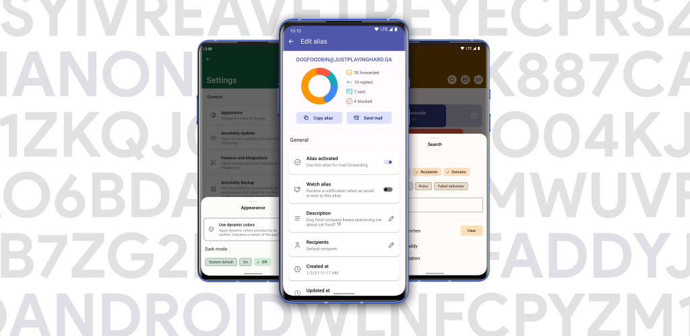

<h1 align="center">addy.io</h1>

Easily create and manage your addy.io aliases, recipients and more from your phone, tablet or wearable with this <b>gorgeous</b> addy.io app for Android.
 

## Requirements

> addy.io

- addy.io instance running v1.0.4 or higher (current version of the addy.io app has been tested with v1.0.4)

> Android

- Android 6.0 or higher
- Wear OS 3.0 (Android 11) or higher (addy.io for Android wearables)

## Characteristics

> Exciting ✨

- Connect to the hosted [addy.io](https://addy.io/) instance or your own self-hosted instance
- A unique, gorgeous and sleek design, based on the [Material You Design](https://m3.material.io/) guidelines
- Support for Deep Link to easily deactivate aliases from the email banner
- Lock the app using Biometrics
- App exclusive features
  - Watching aliases for new emails
  - Send emails from aliases by selecting an email address or clicking a mailto link
  - Get notified on failed deliveries
  - Update multiple aliases at once
  - Get notified on expiring subscriptions
- Enable error logging to *locally* store exceptions for easy troubleshooting
- Export and import *encrypted* backups of the app configuration
- Widgets!

> Seriously 👓

**Security**

- Encrypted preferences, your API key and other addy.io related settings are securely stored on your device using
  the [AndroidX crypto library](https://developer.android.com/jetpack/androidx/releases/security)
- Encrypted app backups, when making a backup of the app configuration through the built-in backup manager
- No stats, buried points or Device IDs, or even crash reporting (Except for Google Play Store builds). So if you get a crash, please share the crash
  info with me >_<.
- I am forgoing the convenient third-party collection SDK and various stats just so you can use it with confidence.  **What's yours is yours**.

 > Manage (add, edit, delete)

- Aliases
- Recipients
- Domains
- Usernames
- Rules
- Failed deliveries

## Download

Developer-led download channels:

> Recommended (access to beta's, automatic updates and support me :) )

- [Google Play](https://play.google.com/store/apps/details?id=host.stjin.anonaddy)
- ⚠️Note: this version charges and contains the Google Play Services so it can be used with addy.io for Android wearables. The rest of the code is identical, so if you'd like to buy me a cup of tea (or if you're more headstrong) then go here
  and download it, otherwise choose another source :)

> Other sources (Without Google Play Services)

- [Gitlab release](https://gitlab.com/Stjin/anonaddy-android/-/releases)
- [F-Droid](https://f-droid.org/packages/host.stjin.anonaddy)

## UI

- Designed by my lovely UI guru @JustPlayingHard (💙)
- Anything you think doesn't work well is my bad as I recreated the UI drafts into XML.
- The icons used are from [Tabler](https://tablericons.com/) (some icons were modified)

## Open Source License.

Third party libraries used. (Main App)

- [Please see build.gradle](https://gitlab.com/Stjin/anonaddy-android/-/blob/master/app/build.gradle.kts)
  - [com.google.android.gms:play-services-wearable](https://mvnrepository.com/artifact/com.google.android.gms/play-services-wearable) (is used for
    communication with WearOS, **available in the Google Play version of the app only**)

Third party libraries used. (WearOS)

- [Please see build.gradle](https://gitlab.com/Stjin/anonaddy-android/-/blob/master/app-wearos/build.gradle.kts)

## Feedback and contribution

I welcome your comments and suggestions in the issues section, or you can contribute your code by submitting a PR directly to me. Of course, you can
also contact the developer directly via telegram or email and I'll get back to you shortly.

## Donation

## Privacy policy
[Privacy policy](https://gitlab.com/Stjin/anonaddy-android/-/blob/master/PrivacyPolicy.md)
