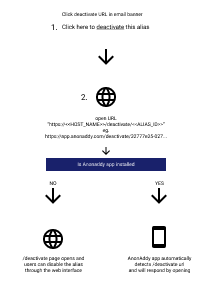
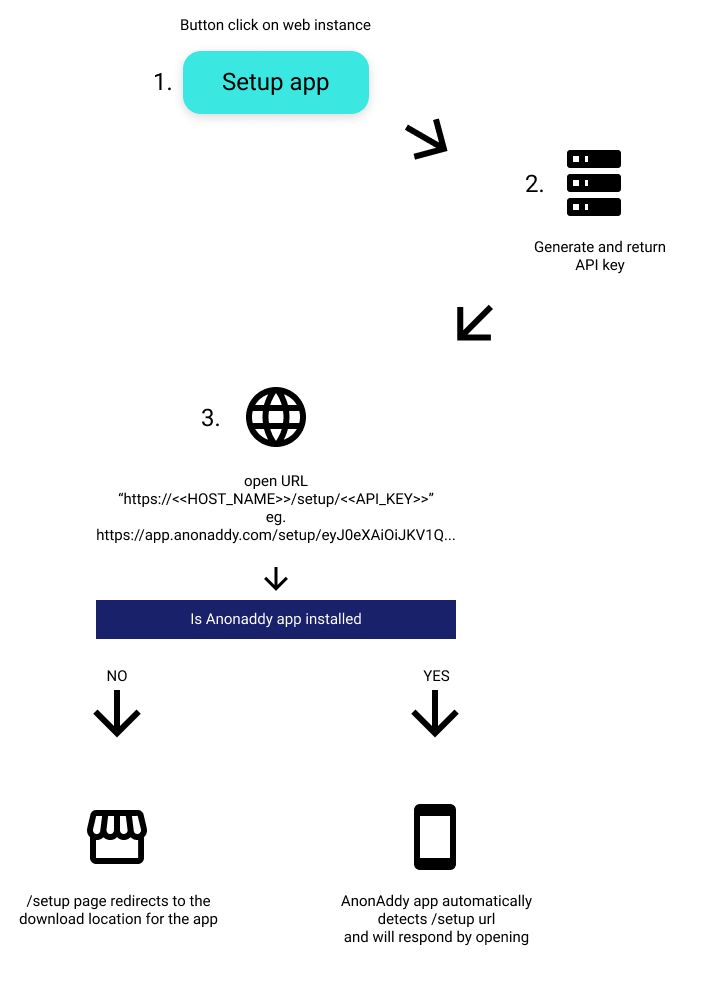

# AnonAddy for Android intents

Intents can be used to simplify actions and create a bridge between AnonAddy for web and AnonAddy for Android

## Current intents

The [manifest](https://gitlab.com/Stjin/anonaddy-android/-/blob/master/app/src/main/AndroidManifest.xml) is being used for receiving intents, it checks for https schemes and pathPrefixes leaving the host a wildcard allowing it to be used with multiple instances.

### Deactivating aliases (found in the email banner)
```xml
<data
android:host="*"
android:pathPrefix="/deactivate"
android:scheme="https" />
```
### Setup the app (not implemented as of January 6, 2021)
```xml
<data
android:host="*"
android:pathPrefix="/setup"
android:scheme="https" />
```

## Usage
### Deactivating aliases
```html
https://<<HOST_NAME>>/deactivate/<<ALIAS_ID>>
```
- HOST_NAME: The base URL of the AnonAddy instance
- API_KEY: The API key generated
### Setup the app
```html
https://<<HOST_NAME>>/setup/<<API_KEY>>
```
- HOST_NAME: The base URL of the AnonAddy instance
- API_KEY: The API key generated

## Flowchart

### Deactivating aliases


### Setup the app


## Questions?
Pull requests are welcome. For major changes, please open an issue first to discuss what you would like to change.
Please make sure to update tests as appropriate.