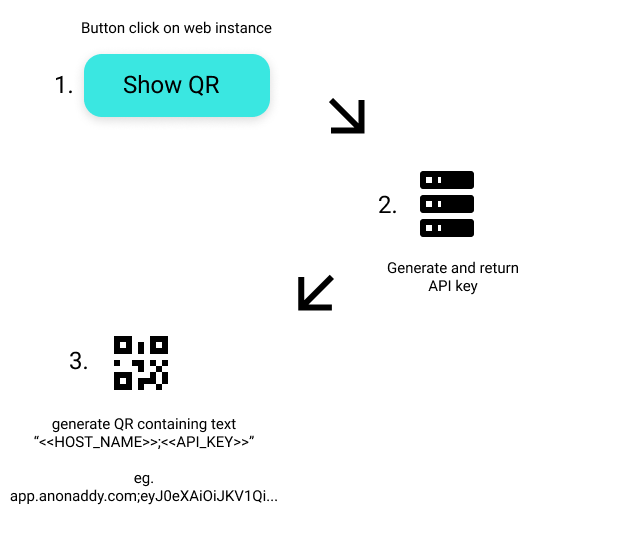

# AnonAddy for Android setup QR  
  
AnonAddy for Android has a QR scanner allowing users to quickly setup the app without having to copy the API key to their phone  
  
## QR format  
  
Any QR code generated in the following format would work, please make sure to generate the QR in a decent-high resolution (preferably SVG)  
  
```  
<<HOST_NAME>>;<<API_KEY>>  
```  
  
- HOST_NAME: The base URL of the AnonAddy instance  
- API_KEY: The API key generated  
  
## Flowchart  
  
### Setup QR


## Questions?  
Pull requests are welcome. For major changes, please open an issue first to discuss what you would like to change.  
Please make sure to update tests as appropriate.

## Assets  
My lovely designer and I have baked a few assets that can be used freely in order to guide users to the right place, these can be found in the /assets folder